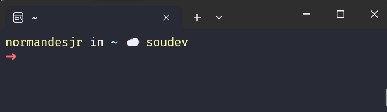
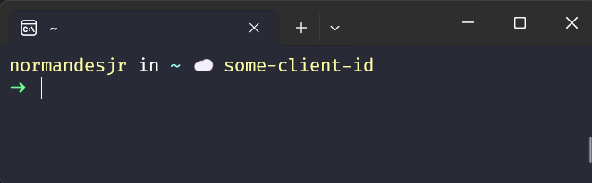

# AWS SSO Plugin for Spaceship

If you use Spaceship, work with multiple AWS accounts, log in using `aws sso login`, and would like to easily see which account you're currently logged into, then this plugin is for you!

I often work with several AWS accounts, such as separate ones for development, staging and production. Sometimes, different products even have their own distinct accounts.

To log into this accounts, I use `aws sso login --profile some-profile`.

Frequently, while working, I need to know which account I'm logged into or if a token for a specific account has expired. This plugin aims to solve that problem.

I use [Spaceship](https://spaceship-prompt.sh/) to customize my Zsh terminal. I use it on macOS (my work laptop) and on Windows (my personal laptop) via [WSL](https://learn.microsoft.com/en-us/windows/wsl/).

## Goal

The goal of this plugin is to display in your terminal which AWS accounts you are currently logged into via `aws sso login --profile my-profile`, as shown in the image below:



As you can see, the name "_soudev_" is shown in the terminal. "_soudev_" is the custom name I've chosen for display, and you can customize these names with this plugin.


## Prerequisites

* AWS CLI
* jq

Of course you will need `aws cli` to use use this plugin because you need it to log in into your AWS account.

The jq is to manipulate the json files that AWS create at _$HOME/.aws/sso/cache_.

To install jq on Ubuntu:

```sh
sudo apt install jq
```

## Installation

To install this plugin just execute this command to clone this repo into Oh-My-Zsh plugin's directory:

```sh
git clone https://github.com/normandesjr/spaceship-aws-ssologin.git $ZSH_CUSTOM/plugins/spaceship-aws-ssologin
```

Then include `spaceship-aws-ssologin` in Oh-My-Zsh plugin list at the file `$HOME/.zshrc`:

```
plugins=($plugins spaceship-aws-ssologin)
```

## Settings

In your _$HOME/.aws_ directory, you can create a configuration file named `accounts.conf` to map the AWS generated `client id` to a more user-friendly name.

The format is `key=value` like the example bellow:

```conf
some-client-id=account-name-that-you-want
```

When you log in for the first time after installing the plugin (or if a mapping is not found in accounts.conf), the plugin will display the client id in your terminal, as shown in the image below



Once you create the accounts.conf file and add the client id as the key and your desired name as the value, you'll see the custom name displayed in your prompt.

## Compatibility

This plugin has been tested with WSL2 on Windows 11 and on macOS with iTerm2.
